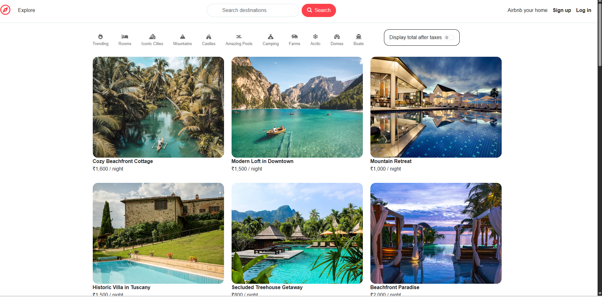
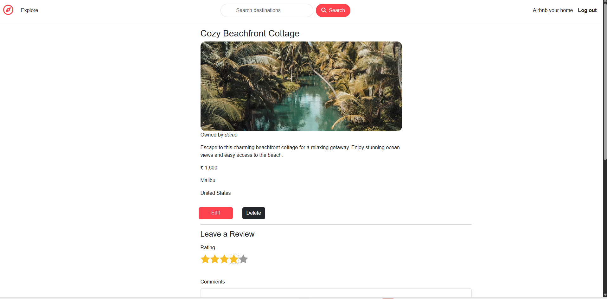
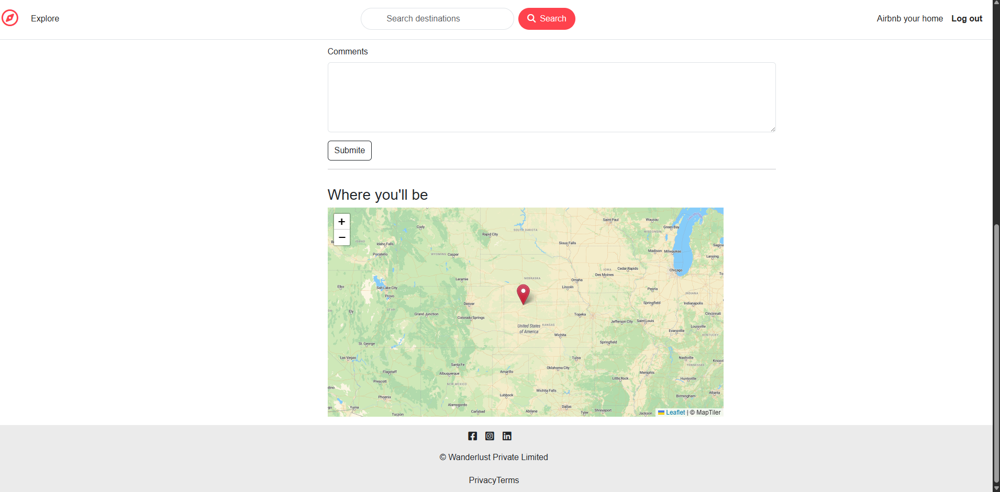
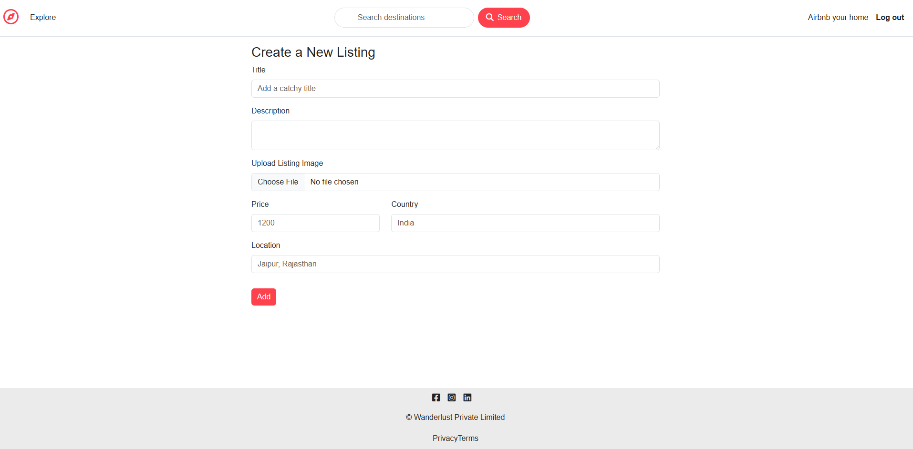
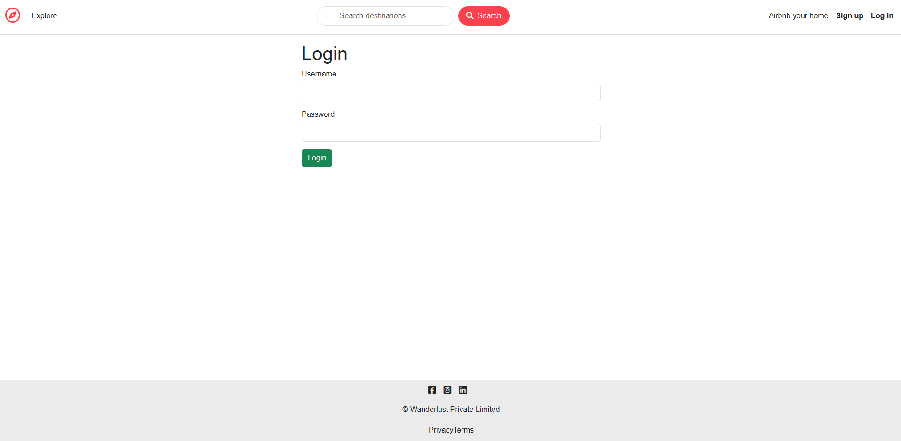
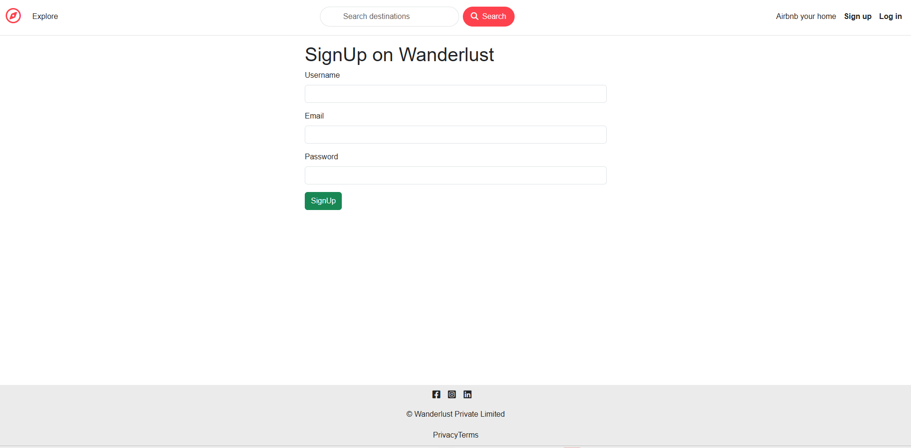

# WanderLust 🌍

A full-stack Airbnb-inspired travel listing web application where users can explore destinations, create listings, upload images, leave reviews, and manage their own properties.

🔗 **Live Demo:** [Click here to Open Project](https://major-project-wanderlust-5nuw.onrender.com)


🔗 **GitHub Repository:** https://github.com/ghausiyaansari77-art/Major-Project-Wanderlust

---

# 🚀 Features

✅ User Authentication & Authorization
✅ Create, Edit & Delete Listings
✅ Secure Login & Signup System
✅ Property Image Uploads with Cloudinary
✅ Interactive Maps Integration
✅ Review & Rating System
✅ Session & Cookie Management
✅ Responsive UI Design
✅ MongoDB Atlas Cloud Database
✅ RESTful APIs & MVC Architecture

---

# 🛠️ Tech Stack

## Frontend

* HTML5
* CSS3
* Bootstrap
* EJS

## Backend

* Node.js
* Express.js

## Database

* MongoDB Atlas
* Mongoose

## Authentication & Security

* Passport.js
* Express Session
* Connect Flash
* Helmet.js

## Cloud & APIs

* Cloudinary
* Mapbox / MapTiler
* Render Deployment

---

# 📂 Project Architecture

```txt
WanderLust/
│
├── controllers/
├── models/
├── routes/
├── views/
├── public/
├── utils/
├── middleware.js
├── cloudConfig.js
├── app.js
└── package.json
```

---

# ⚙️ Installation & Setup

## Clone Repository

```bash
git clone https://github.com/ghausiyaansari77-art/Major-Project-Wanderlust
```

## Install Dependencies

```bash
npm install
```

## Create `.env` File

```env
ATLASDB_URL=your_mongodb_connection_url
SECRET=your_session_secret

CLOUD_NAME=your_cloudinary_name
CLOUD_API_KEY=your_cloudinary_key
CLOUD_API_SECRET=your_cloudinary_secret

MAP_TOKEN=your_map_token
```

## Run Application

```bash
node app.js
```

---

# 🌐 Deployment

The application is deployed using:

* Render
* MongoDB Atlas
* Cloudinary

---

# 📸 Screenshots

## Home Page



## Listing Details Page



## Map


## Add New Listing



## Login & Signup




---

# 🔐 Security Features

* Password Authentication with Passport.js
* Environment Variables for Sensitive Data
* Protected Routes & Authorization Middleware
* Secure Sessions & Cookies
* MongoDB Atlas Cloud Security

---

# 📚 What I Learned

* Full-Stack Web Development
* REST APIs & MVC Architecture
* Authentication & Authorization
* Cloud Database Integration
* Deployment & Environment Configuration
* File Upload Management
* Real-World Debugging & Error Handling

---

# 👩‍💻 Author

**Ghausiya Ansari**.

* GitHub:https://github.com/ghausiyaansari77-art
* LinkedIn: https://www.linkedin.com/in/ghausiya-ansari-1b38a9391/
